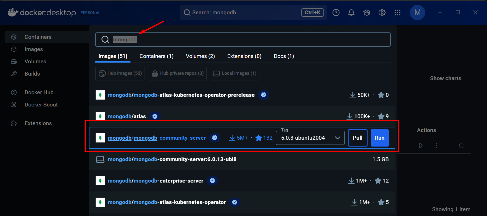
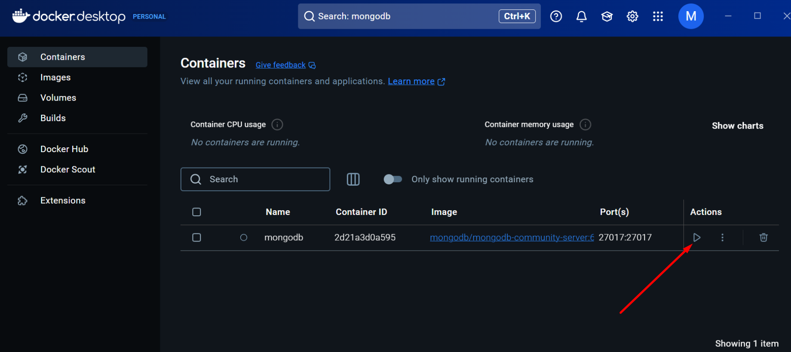
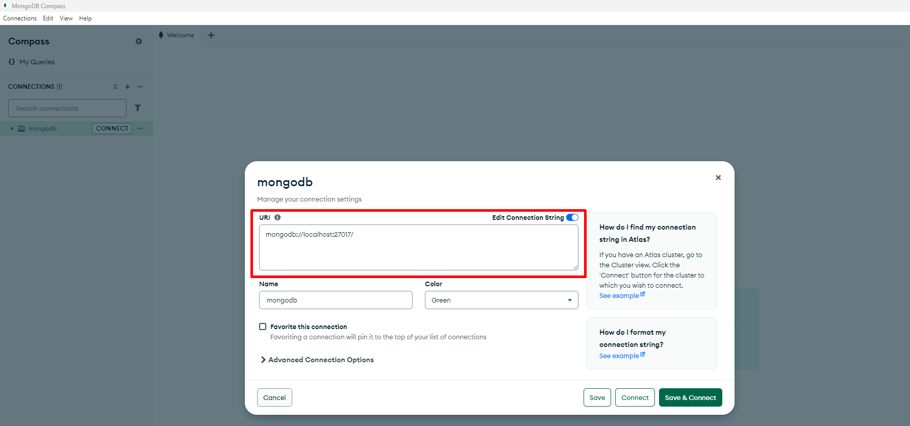
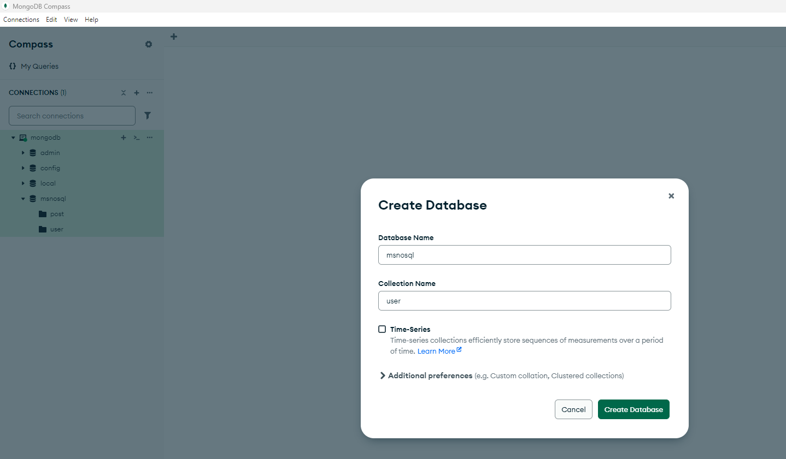

# Projeto Micro Serviço se conectando ao mongoDB.


## Stacks
Java 

## Banco 
Mongo DB

## Tools
Docker Desktop

## Frameworks

- Spring-Boot-Data-MongoDB
- Spring-Boot-Starter-Web
- Spring-Boot-Starter-Test
- Lombok


## Gerenciador de dependências
Maven

## Carga Inical
@Bean

## Query Methods (Spring Data MongoDB)


## Swagger Ui

Para acessar:
```
http://localhost:8080/swagger-ui/index.html
```

## Boas praticas
- Commits semanticos
- Git Flow


## Etapas para executar o projeto

Serão informados os passos para a execução projeto.


### Premissas
- Java 17 instalado e devidamente configurado
- IDE para abrir o projeto(Eu usei Intellij)
- Docker Desktop
- MongoDBCompass

### Passo a passo
- Download do projeto msnosql
```
git clone https://github.com/maikcosta/msnosql.git
```
- Download imagem mongodb no docker hub através do Docker Desktop

- Executar o mongodb

- Criar conexão com o banco mongodb

- Criar database msnosql


